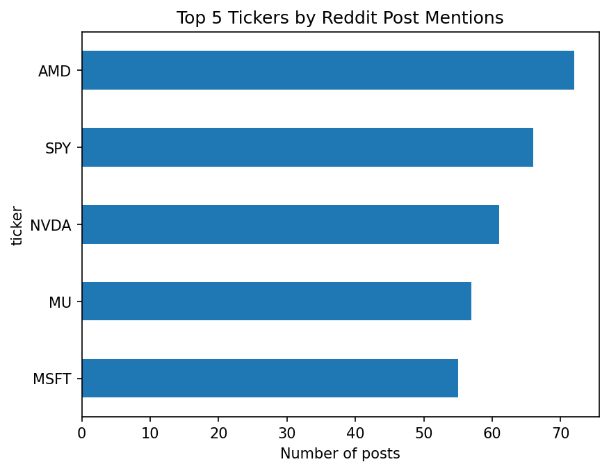
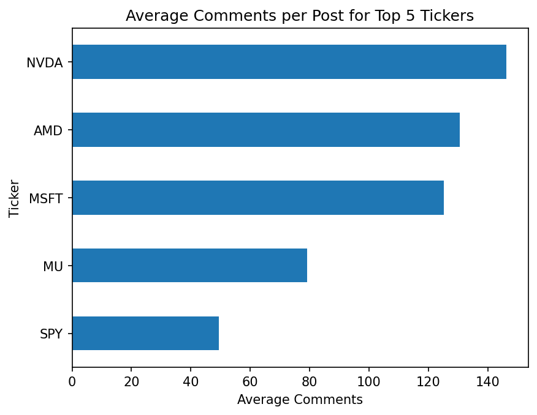
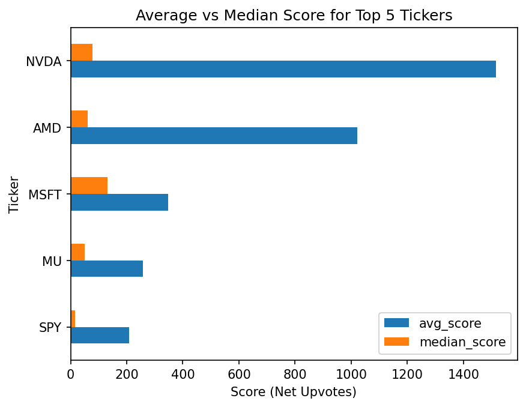
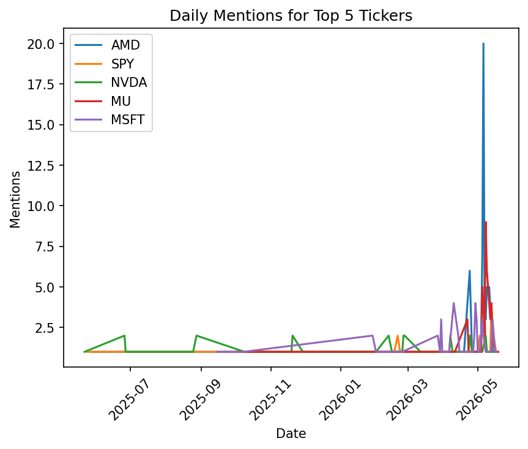
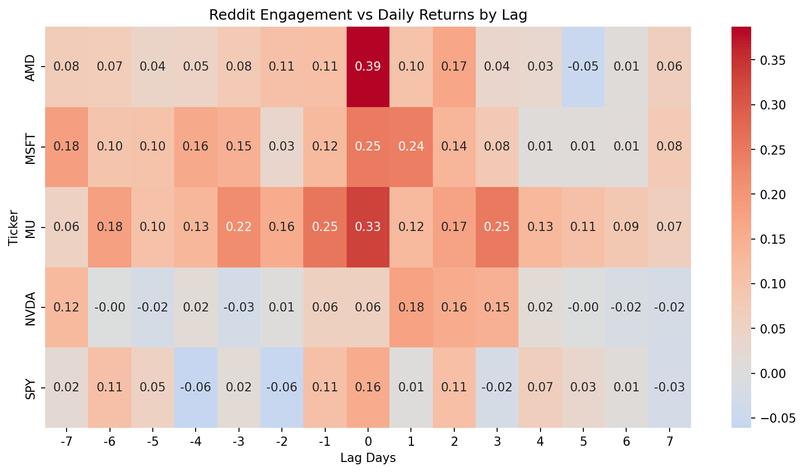
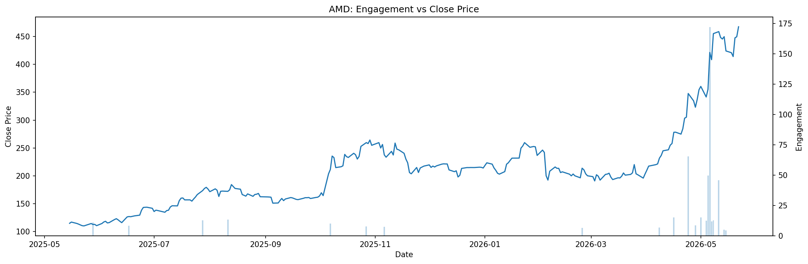
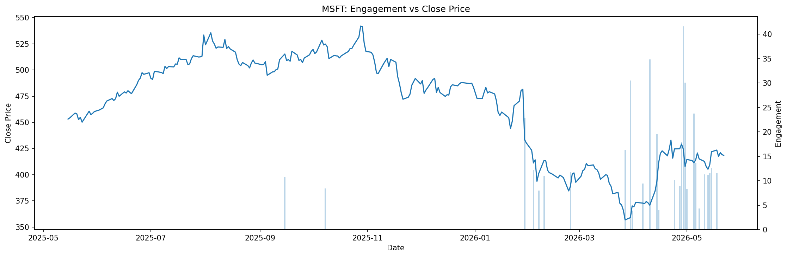
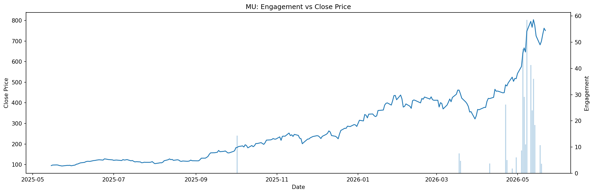
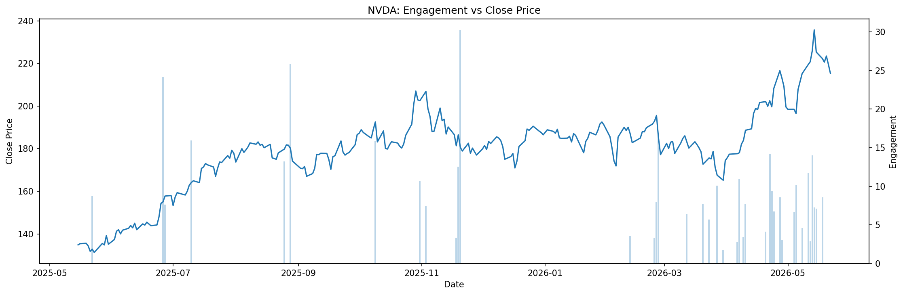
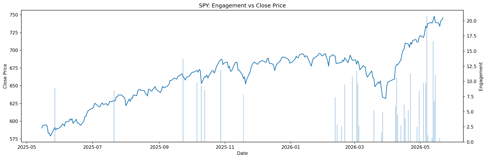

# Reddit Finance Sentiment Analysis

This is an exploratory data analysis (EDA) project that examines finance-related Reddit posts to understand ticker attention, user engagement, and how online discussion responds to market movement.

---

## Overview

This project scrapes post data from Reddit's finance-related communities, extracts stock ticker mentions from post titles, and analyzes whether Reddit engagement is correlated with or anticipates movements in stock prices. 

This is not a trading model. It is an analytics project focused on attention, engagement, and market reaction patterns.

---

## Data Collection

To build the dataset, posts were gathered from 10 finance-related subreddits using Reddit’s public JSON endpoints. For each subreddit, I collected posts from three feeds:

- `/r/{subreddit}/new.json`
- `/r/{subreddit}/top.json?t=month`
- `/r/{subreddit}/top.json?t=year`

The subreddits included were:

`wallstreetbets` `investing` `stocks` `StockMarket` `SecurityAnalysis` `ValueInvesting` `dividends` `options` `Daytrading` `pennystocks`

These feeds included a mix of recent conversations and posts that had received strong engagement. After collecting the data, I filtered the posts to focus on activity from January 2025 through May 2026. For the stock market analysis, I pulled OHLCV price data from Stooq for the five tickers that appeared most often in the Reddit posts. After removing duplicates, bots, and deleted accounts, the final dataset included 13,218 posts from the 10 subreddits.


---

## Project Structure

```
reddit-finance-sentiment-analysis/
│
├── extract_1.py                          # Reddit scraping script
├── cleaning.ipynb                        # Data cleaning and feature engineering
├── tickers_eda.ipynb                     # Ticker extraction and engagement analysis
├── engagement_price_correlation.ipynb    # Price correlation and lag analysis
│
└── charts/
    ├── top_tickers_by_mentions.png
    ├── avg_comments_per_post.png
    ├── avgvsmedian_score.png
    ├── daily_mentions_over_time.png
    ├── engagement_vs_price_AMD.png
    ├── engagement_vs_price_MSFT.png
    ├── engagement_vs_price_MU.png
    ├── engagement_vs_price_NVDA.png
    ├── engagement_vs_price_SPY.png
    └── lag_correlation_heatmap.png
```

---

## Key Findings

**1. AMD led Reddit attention**
AMD was the most mentioned ticker with 72 posts, followed closely by SPY (66), NVDA (61), MU (57), and MSFT (55).



**2. NVDA and AMD drove the most engagement per post**
Despite AMD leading in mentions, NVDA posts averaged ~145 comments per post — the highest of any ticker. AMD followed at ~130. SPY had the lowest at ~50, suggesting broad market discussion generates less debate than individual stock picks.



**3. Engagement is heavily skewed by viral posts**
For every ticker, the average score was significantly higher than the median score. NVDA's average score was ~1,500 vs a median of ~75 — meaning a small number of high-performing posts pulled the mean up dramatically. Median score is the more reliable measure of a typical post.



**4. Reddit activity spiked in April–May 2026**
Mentions were relatively flat from mid-2025 through early 2026, then exploded across all tickers in April–May 2026. This could have been driven by earnings season. AMD saw a single-day spike of 20 mentions, its highest in the dataset.



**5. Reddit engagement is reactive, not predictive**
The lag correlation analysis across a ±7 day window showed that same-day correlation (lag=0) was the strongest for most tickers. AMD had the highest same-day correlation at 0.39, followed by MU at 0.33. No ticker showed a consistent pattern of Reddit activity leading price movement, suggesting the community reacts to market events rather than anticipating them.



**6. NVDA and SPY showed the weakest price-engagement relationship**
Despite NVDA being one of the most discussed tickers, its lag correlations were near zero across the board. SPY was similarly flat, which makes sense — broad market ETFs attract constant background chatter regardless of daily price movement.

**Engagement vs. Closing Price by Ticker**








--- 


## How to Reproduce

1. Clone the repo
2. Install dependencies: `pip install pandas requests matplotlib seaborn yfinance`
3. Run `extract_1.py` to collect Reddit posts
4. Run `cleaning.ipynb` to clean the data
5. Run `tickers_eda.ipynb` for ticker extraction and engagement analysis
6. Download OHLCV data from [Stooq](https://stooq.com/) for AMD, MSFT, MU, NVDA, SPY
7. Run `engagement_price_correlation.ipynb` for price correlation and lag analysis


## Limitations

- Reddit’s JSON API only returns up to 1,000 posts per feed, which means older posts may not be fully captured.
- Tickers were identified using regex pattern matching, so some symbols may have been missed or incorrectly flagged.
- The dataset focuses on a limited time period and only the five most mentioned tickers, so the findings should be treated as exploratory rather than broadly generalizable.
- Overall correlation values were weak, meaning this analysis is better suited for describing patterns than making predictions.


